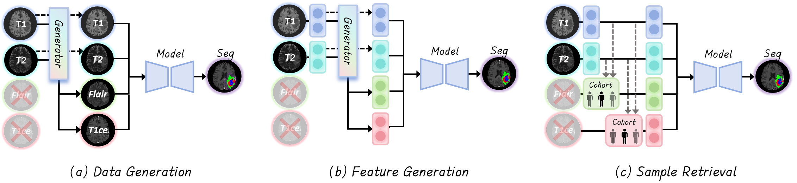
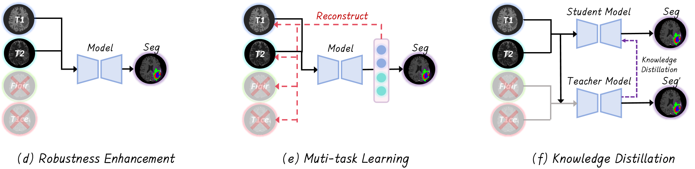
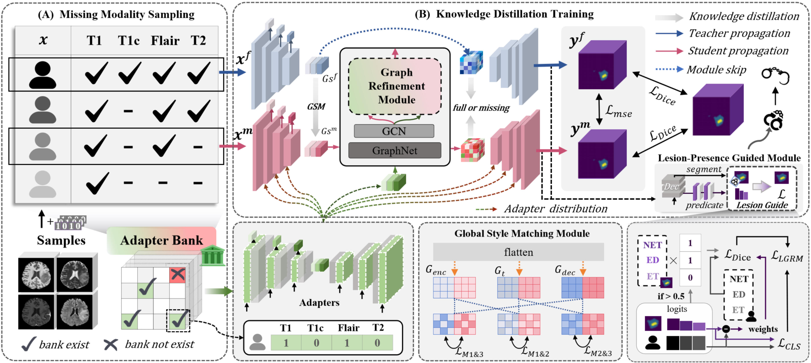
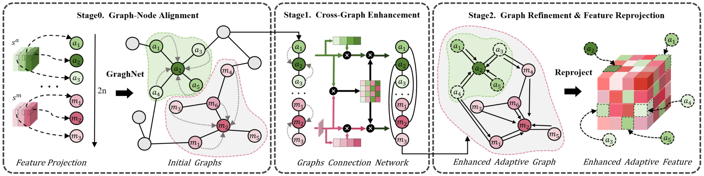
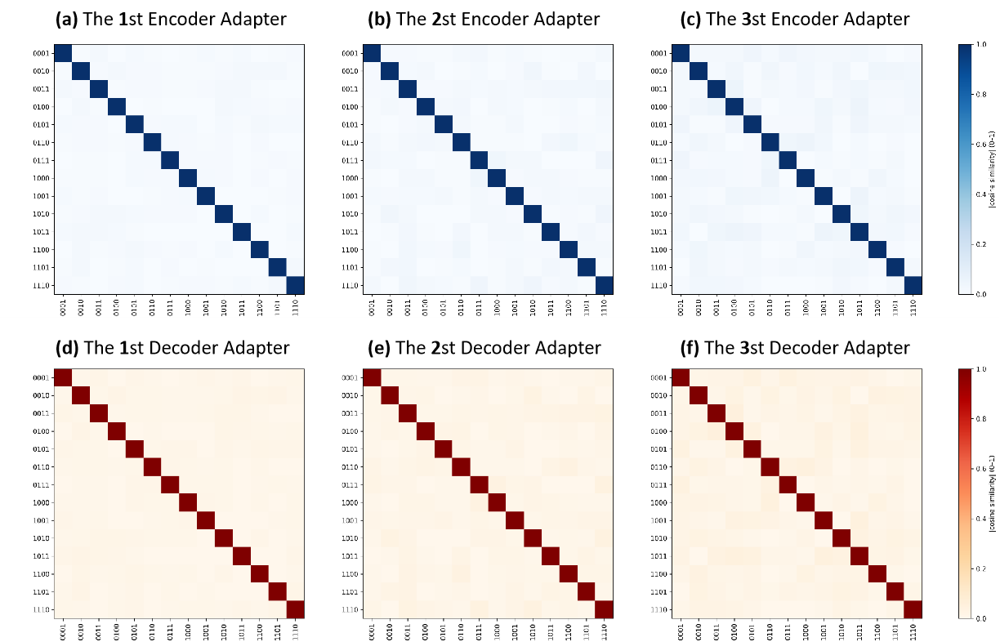
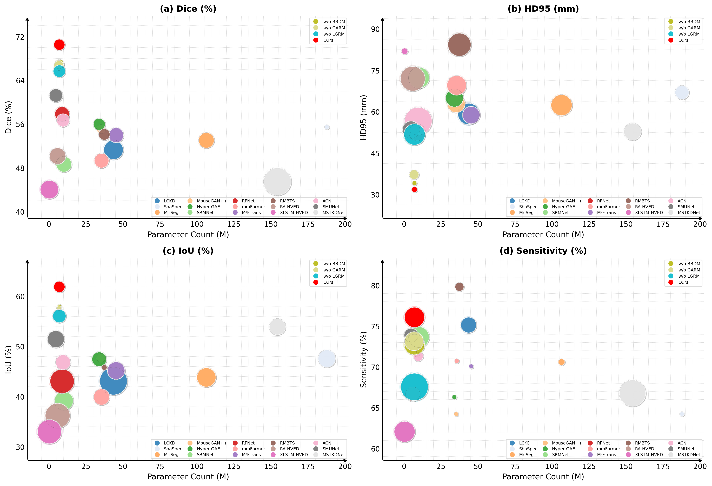
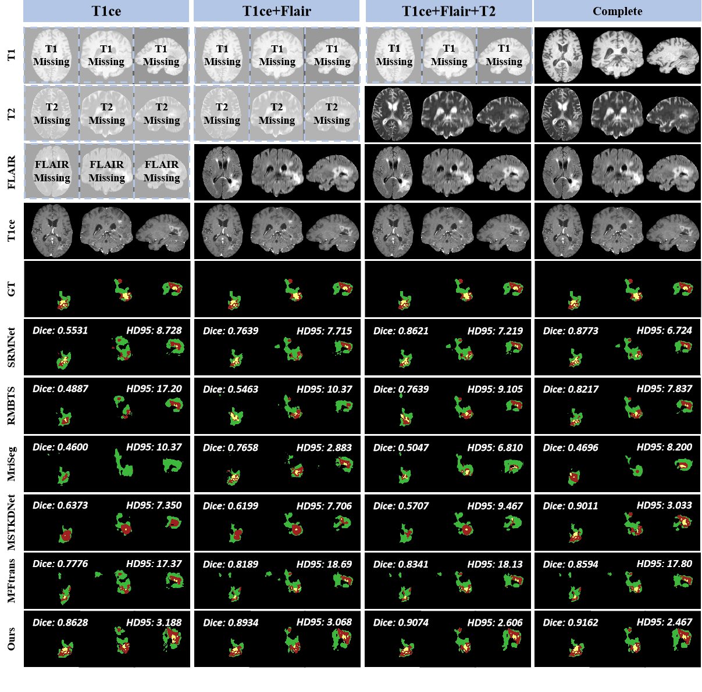
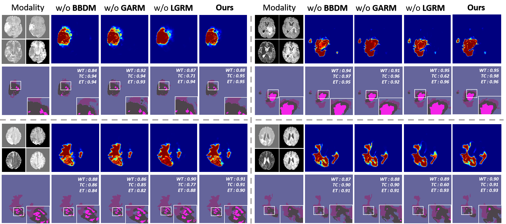

<h1 align="center">
   N&nbsp;O&nbsp;｜&nbsp;M&nbsp;⬢&nbsp;D&nbsp;A&nbsp;L&nbsp;I&nbsp;T&nbsp;Y&nbsp;｜&nbsp;L&nbsp;E&nbsp;F&nbsp;T&nbsp;｜&nbsp;B&nbsp;E&nbsp;H&nbsp;I&nbsp;N&nbsp;D
</h1>

> It serves not only as a model, but also as a benchmark.

<div align="center">

[](https://github.com/Quanato607/AdaMM)
[](https://github.com/Quanato607/AdaMM)
[](https://github.com/Quanato607/AdaMM)
[](https://arxiv.org/abs/2030.12345)
</div>

This implementation of **No Modality Left Behind: Adapting to Missing Modalities via Knowledge Distillation for Brain Tumor Segmentation**. 

## 🎥 Visualization for Implementation on Software

<div align="center">

</div>

## ⬢ Related Works

<p align="center">
  
</p>
<p align="center">
  
</p>

> (a) **Data Generation** — Synthesizes missing modalities to form a complete four-channel input.  
> (b) **Feature Generation** — Hallucinates modality-specific features when inputs are absent.  
> (c) **Sample Retrieval** — Uses modality-matched cases to replace missing scans.  
> (d) **Robustness Enhancement** — Applies random modality dropout for direct segmentation from available scans.  
> (e) **Multi-task Learning** — Reconstructs missing modalities while outputting the segmentation mask.  
> (f) **Knowledge Distillation** — Teacher guides student via feature and prediction alignment under missing inputs.

## 🧗Proposed method
<br><br>

<br><br>

> **Framework overview**  (A) **Missing-modality Sampling** — Generates 15 MRI modality combinations and leverages an Adapter Bank to compensate for absent inputs.  (B) **Knowledge-distillation Training** — Incorporates **BBDM**, **GARM**, and **LGRM**, with **GARM** applied exclusively to the student branch.

## ⬢ Requirements

To install requirements:

```setup
pip install -r requirements.txt
```

## ⬢ Training

To train our model in the paper, run this command:

```train
python train_adamm_divide.py
```

<p align="center">
  
</p>

> **Graph-guided Adaptive Refinement Module** - **Stage 0 – Graph–node Alignment** — Establishes consistent correspondence between nodes across modality-specific and shared graphs.   - **Stage 1 – Cross-graph Enhancement** — Facilitates mutual information exchange to enrich node representations.   - **Stage 2 – Graph Refinement & Feature Reprojection** — Progressively refines node embeddings and projects them back to the feature space for downstream processing.

## ⬢ Evaluation

To evaluate our model in the paper, run this command:

```eval
python eval.py
```

<br><br>

<br><br>

> **Lesion-Presence-Guided Reliability Module** — For each slice, voxel-level probability maps from the student (left) and teacher (right) are aligned with the ground-truth label map (centre) using voxel-wise mean-squared error. At the same time, the three lesion classes (**NET**, **ET**, **ED**) are collapsed into existence scores, which are then matched to the binary presence vector of the label via an entropy loss.

## ⬢ Special Handling of HD95 in Brain Tumor Segmentation

Because **HD95** is defined as the 95th percentile distance between the boundary points of the predicted segmentation map and the ground truth label map, its value is theoretically infinite when either map contains no lesion and therefore has no boundary. In practice, however, an infinite value cannot be directly displayed or aggregated as a valid metric. Consequently, various studies adopt different handling strategies under the many modality–missing scenarios, leading to inconsistent evaluation results.

A survey and reproduction of current missing–modality segmentation literature reveal **three mainstream approaches** to these special HD95 cases:

### Strategy 1: HD95 = 0 when only one map contains lesions
When only the prediction or the label map contains lesions, set **HD95** to `0`.  
This strategy treats the absence of a common boundary as “optimal”, directly assigning HD95 = 0. We argue that it grossly underestimates segmentation error: when one map contains lesions and the other does not, the model clearly produces false positives or false negatives, yet is erroneously rated best. This approach often drives HD95 to trend inversely with **Dice**, especially in the **BraTS** dataset, where the WT, TC, and ET regions may legitimately contain no lesions, thereby misleading model assessment.

### Strategy 2: Conditional assignment (393.13 or 0)
When the label map lacks lesions but the prediction map contains lesions, set **HD95** to `393.13`; otherwise, set it to `0`.  
Compared with Strategy 1, this method prevents some misjudgments, but a notable bias remains: when the prediction map lacks lesions and the label map contains lesions (i.e., a miss), HD95 is still zero and therefore fails to capture the severity of the error. This asymmetric treatment continues to distort the metric and lowers evaluation accuracy.

### Strategy 3: Uniform penalty for mutually exclusive lesions
When the prediction and label maps are mutually exclusive (i.e., lesions in one but not the other), set **HD95** uniformly to `393.13`.  
We consider this strategy most consistent with evaluation logic and practical needs. It substitutes infinity with the maximum spatial diagonal (240 × 240 × 155) distance commonly encountered in images, ensuring that HD95 imposes a severe penalty for major false positives or false negatives. Additionally, it maintains a positive correlation with other metrics such as **Dice** and **IoU** across all prediction–label combinations, thereby improving evaluative consistency and stability.


## ⬢ Diversity of Adapters

<p align="center">
  
</p>

> **Cosine similarity heatmaps of adapter parameters** — Each four-digit code denotes available modalities in the order **[T1, T1Gd, T2, FLAIR]** (1 = present, 0 = absent). **(a–c)** 1st–3rd encoder adapters, **(d–f)** 1st–3rd decoder adapters. Deeper adapters exhibit higher inter-configuration similarity, suggesting convergence toward consistent full-modality feature approximation while preserving clear modality-combination specificity.

## ⬢ Results of Performance

<p align="center">
  
</p>

> **Scatter plots of model performance vs. parameter count** — Across four evaluation metrics: (a) **Dice (%)**, (b) **HD95 (mm)**, (c) **IoU (%)**, and (d) **Sensitivity (%)**. The proposed method (**Ours**) is highlighted in red.

## ⬢ Results of Comparision Experiment

<p align="center">
  
</p>

> **Qualitative comparison on the BraTS 2024 dataset** — Visualization of a randomly selected sample from the BraTS 2024 dataset, showing segmentation results under different modality-missing combinations across three axial views. The corresponding multimodal MRI sequences and ground truth are presented alongside model outputs. **Dice** and **HD95** metrics are provided for each model–combination pair. Our model (**Ours**) achieves superior segmentation accuracy and edge-control, with higher Dice scores and lower HD95 values across various missing-modality scenarios.  
**Color legend:** WT = red + yellow + green, TC = red + yellow, ET = red.

## ⬢ Results of Ablation Experiment

<p align="center">
  
</p>

> **Qualitative ablation study on the BraTS 2024 dataset** — Input images and ground-truth masks are shown for four modality configurations (**T1**, **T1+T1Gd+T2+FLAIR**, **T1Gd+T2**, and **T1+T1Gd+T2**). From left to right, the remaining columns display segmentation outputs and prediction heatmaps from models **without BBDM**, **without GARM**, **without LGRM**, and **with the complete model**. **Dice** scores for WT, TC, and ET are reported.

