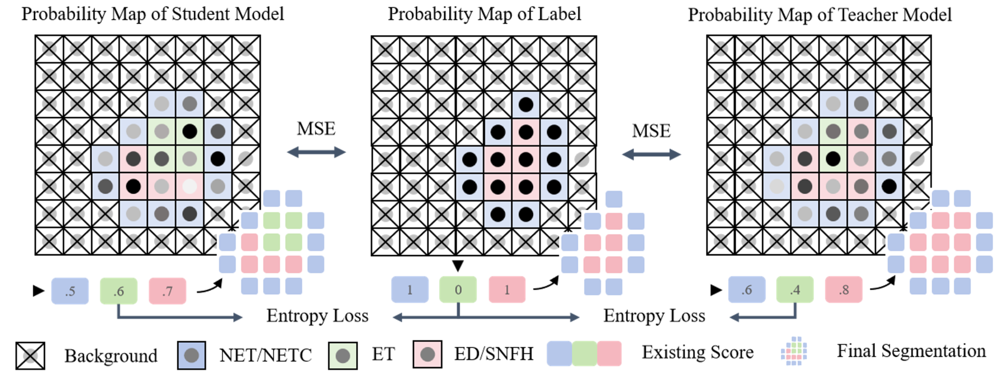
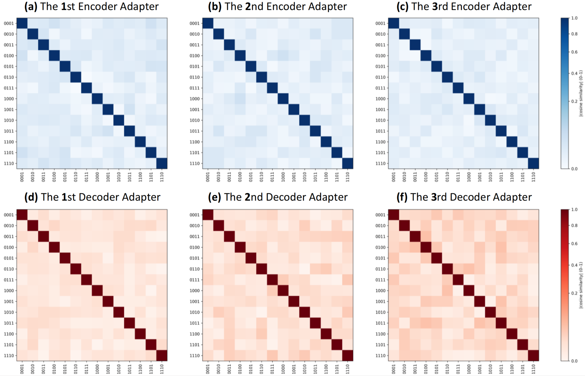

<h1 align="center"> N&nbsp;O&nbsp;&nbsp;M&nbsp;⬢&nbsp;D&nbsp;A&nbsp;L&nbsp;I&nbsp;T&nbsp;Y&nbsp;&nbsp;L&nbsp;E&nbsp;F&nbsp;T&nbsp;&nbsp;B&nbsp;E&nbsp;H&nbsp;I&nbsp;N&nbsp;D</h1>


<div align="center">

[](https://github.com/Quanato607/AdaMM)
[](https://github.com/Quanato607/AdaMM)
[](https://github.com/Quanato607/AdaMM)
[](https://arxiv.org/abs/2030.12345)
</div>

This implementation of **No Modality Left Behind: Adapting to Missing Modalities via Knowledge Distillation for Brain Tumor Segmentation**. 

## 🎥 Visualization for Implementation on Software

<div align="center">

</div>

## ⬢ Related Works

<p align="center">
  
</p>
<p align="center">
  
</p>

> (a) **Data Generation** — An external generator synthesizes absent modalities, creating a complete four-channel input for the segmentation model.  (b) **Feature Generation** — The network learns to hallucinate modality-specific features internally when inputs are missing.  (c) **Sample Retrieval** — Retrieves training cases from modality-matched cohorts to substitute absent scans before segmentation.  (d) **Robustness Enhancement** — Trains with random modality dropout to segment directly from available scans.  (e) **Multi-task Learning** — An auxiliary decoder reconstructs absent modalities (red dashed arrows) while the main branch outputs the segmentation mask.  (f) **Knowledge Distillation** — A full-modality teacher guides a partial-modality student via feature and prediction alignment, improving accuracy under incomplete inputs.

## 🧗Proposed method
<br><br>

<br><br>

> **Framework overview**  (A) **Missing-modality Sampling** — Generates 15 MRI modality combinations and leverages an Adapter Bank to compensate for absent inputs.  (B) **Knowledge-distillation Training** — Incorporates **BBDM**, **GARM**, and **LGRM**, with **GARM** applied exclusively to the student branch.

## ⬢ Requirements

To install requirements:

```setup
pip install -r requirements.txt
```

## ⬢ Training

To train our model in the paper, run this command:

```train
python train.py
```

<p align="center">
  
</p>

> **Graph-guided Adaptive Refinement Module** - **Stage 0 – Graph–node Alignment** — Establishes consistent correspondence between nodes across modality-specific and shared graphs.   - **Stage 1 – Cross-graph Enhancement** — Facilitates mutual information exchange to enrich node representations.   - **Stage 2 – Graph Refinement & Feature Reprojection** — Progressively refines node embeddings and projects them back to the feature space for downstream processing.

## ⬢ Evaluation

To evaluate our model in the paper, run this command:

```eval
python eval.py
```

<br><br>

<br><br>

> **Lesion-Presence-Guided Reliability Module** — For each slice, voxel-level probability maps from the student (left) and teacher (right) are aligned with the ground-truth label map (centre) using voxel-wise mean-squared error. At the same time, the three lesion classes (**NET**, **ET**, **ED**) are collapsed into existence scores, which are then matched to the binary presence vector of the label via an entropy loss.


## ⬢ Diversity of Adapters

<p align="center">
  
</p>

> **Cosine similarity heatmaps of adapter parameters** — Each four-digit code denotes available modalities in the order **[T1, T1Gd, T2, FLAIR]** (1 = present, 0 = absent). **(a–c)** 1st–3rd encoder adapters, **(d–f)** 1st–3rd decoder adapters. Deeper adapters exhibit higher inter-configuration similarity, suggesting convergence toward consistent full-modality feature approximation while preserving clear modality-combination specificity.

## ⬢ Results of Performance

<p align="center">
  
</p>

> **Scatter plots of model performance vs. parameter count** — Across four evaluation metrics: (a) **Dice (%)**, (b) **HD95 (mm)**, (c) **IoU (%)**, and (d) **Sensitivity (%)**. The proposed method (**Ours**) is highlighted in red.

## ⬢ Results of Comparision Experiment

<p align="center">
  
</p>

> **Qualitative comparison on the BraTS 2024 dataset** — Visualization of a randomly selected sample from the BraTS 2024 dataset, showing segmentation results under different modality-missing combinations across three axial views. The corresponding multimodal MRI sequences and ground truth are presented alongside model outputs. **Dice** and **HD95** metrics are provided for each model–combination pair. Our model (**Ours**) achieves superior segmentation accuracy and edge-control, with higher Dice scores and lower HD95 values across various missing-modality scenarios.  
**Color legend:** WT = red + yellow + green, TC = red + yellow, ET = red.

## ⬢ Results of Ablation Experiment

<p align="center">
  
</p>

> **Qualitative ablation study on the BraTS 2024 dataset** — Input images and ground-truth masks are shown for four modality configurations (**T1**, **T1+T1Gd+T2+FLAIR**, **T1Gd+T2**, and **T1+T1Gd+T2**). From left to right, the remaining columns display segmentation outputs and prediction heatmaps from models **without BBDM**, **without GARM**, **without LGRM**, and **with the complete model**. **Dice** scores for WT, TC, and ET are reported.

